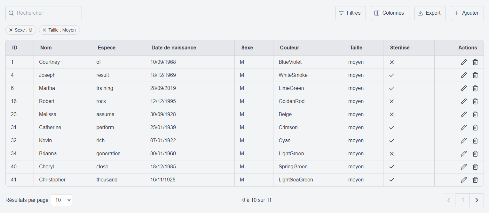

# 🥗 CruditeJS

A React library for building datatables with filtering, pagination, and more. Note that CruditeJS works with an API that follows its model (I made mine with Django REST Framework).



## Installation (Manual)

1. Clone the repository:
```bash
git clone https://github.com/FlorentOsmont/CruditeJS.git
cd crudites-js
```

2. Install dependencies:
```bash
npm install
```

3. Build the library:
```bash
npm run build
```

## ⚠️ API Compatibility Requirements

For CruditeJS to function correctly, your API must be structured as follows:

- The API endpoint should be accessible at: `http://127.0.0.2:8000/api/animals/`.
- The API should support search functionality using the query parameter:
  ```plaintext
  ?search=<query>
  ```
- Filtering should be available for all key parameters using:
  ```plaintext
  ?key=value
  ```
- Pagination should be handled with:
  ```plaintext
  ?limit=X&offset=Y
  ```
- For date range filters, CruditeJS will automatically generate queries like:
  ```plaintext
  ?birth_date_start=<start_date>&birth_date_end=<end_date>
  ```
- The API response must be in the following format:
  ```json
  {
    "count": <total_entries>,
    "results": [
      { "id": 1, "name": "Example", "birth_date": "2022-01-01", ... },
      { "id": 2, "name": "Another Example", "birth_date": "2023-01-01", ... }
    ]
  }
  ```

## Quick Start

```jsx
import { Crudite } from "crudites-js";

const config = {
  apiUrl: "your-api-endpoint",
  pagination: { limit: 10, offset: 0 },
  columns: [
    { key: "id", label: "ID", type: "text", visible: true },
    { key: "name", label: "Name", type: "text", visible: true },
  ]
};

function App() {
  return <Crudite config={config} />;
}
```

## Features

- Dynamic table with pagination
- Advanced filtering (text, date range, boolean, multiple choice)
- CRUD actions

## Column Types (more comming)

| Type     | Description                                     |
|----------|-------------------------------------------------|
| `text`   | Simple text field                               |
| `date`   | Date field with optional range filter           |
| `boolean`| Boolean field with true/false filter            |
| `choices`| Field with predefined choices                   |
| `actions`| Action buttons column                           |


## Contributing

Feel free to open issues and pull requests!

## License

This project is licensed under the terms of the [MIT License](LICENSE). See the LICENSE file for details.

